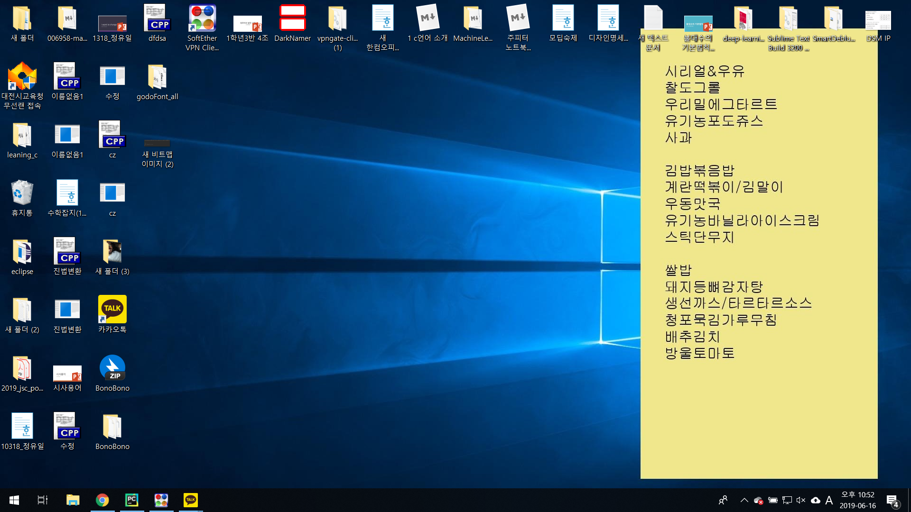

# Wallpaper change program using web crawling

웹에서 받아온 급식데이터를 바탕화면에 출력해주는 프로그램

### 사용한 파이썬 라이브러리

- requests
- BeautifulSoup
- Pillow
- ctypes

### 사용하는 방법
 작업스케줄러에 실행파일을 등록하여서 사용합니다.

### 변경된 바탕화면
 
